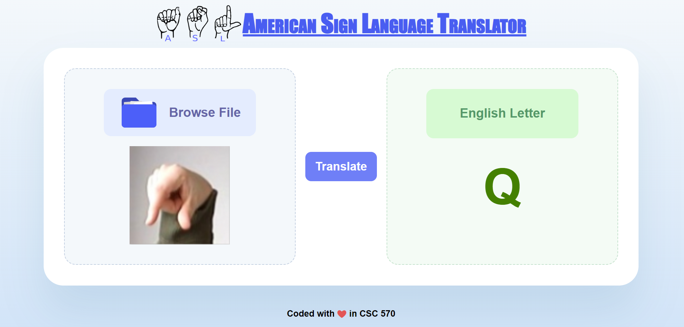
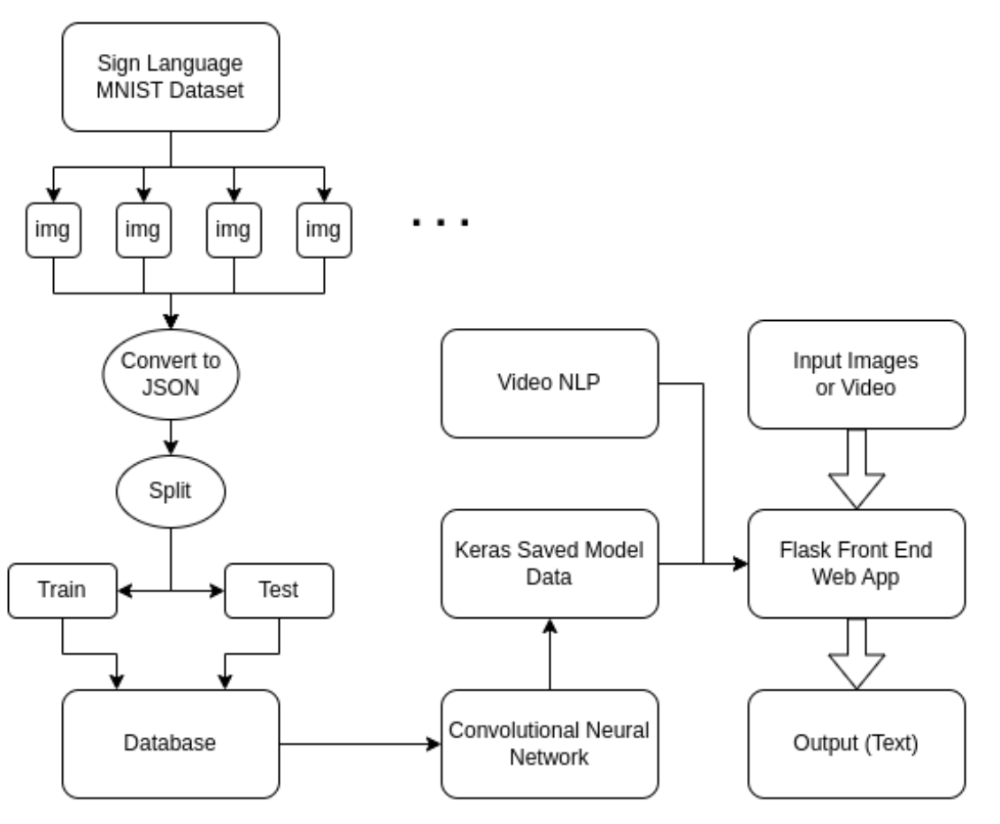

# American Sign Language Translator Web Application


This application converts different ASL hand signs to letters. It uses images and videos of the different ASL letters and train our Deep Learning model.Finally, the frontend will take an image as an input with an ASL sign and output the subtitles on the Web App.

## Model Overview

We use a Convolutional Neural Network (CNN) adapted from this notebook on [kaggle](https://www.kaggle.com/code/madz2000/cnn-using-keras-100-accuracy). It has 3 convolutional layers interspersed with batch normalization, max pooling, and dropout layers. Softmax layer is applied at the end to transform the output into a vector of probabilities for each letter.

The code for the CNN can be found in the file named CSC_570_ASL_CNN.ipynb


For runing the backend first please go to the backend and run create_db.ipynb to build the database and then run:

```bash
uvicorn main:app --reload
```
After that by going to 
```
http://127.0.0.1:8000
```
 You can access to frontend.

 

## Pipeline Overview



